# VSCode_Python_Setup

This is a simple guide for setting up VSCode for Python.

I have seen many guides on this same topic but I found many of them unsatisfying.

So, I decided to make my own guide!

#### NOTE: This guide is for Windows based machines.[ Although, most of the steps should be the same for Mac/Linux Machines.]

#### This guide also assumes that you have Python installed on your system already.

Before we get started, here are is a common action that I will be referring to:

- Opening Settings.json/ adding lines to it.
    - to open Settings.json, hit Ctrl+Shift+P and search for Settings JSON and select the option that says "Preferences: Open Settings(JSON)"

### *Step 1: Installing VSCode:*

This step is pretty self-explanatory. To download VSCode, go to https://code.visualstudio.com/

Download the file as per your device and run it to set it up.

After the installation is complete, you should be greeted with a screen like this:

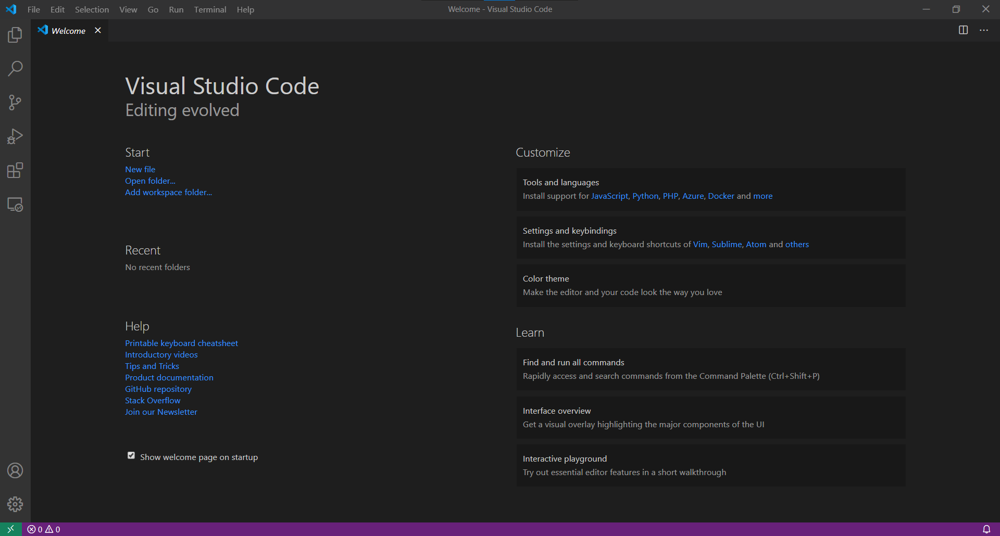

----
### *Step 2: Setting Up Python for VSCode:*

First things first, go to the VSCode Extensions Panel (Ctrl+Shift+X on Windows)


and search for Python.

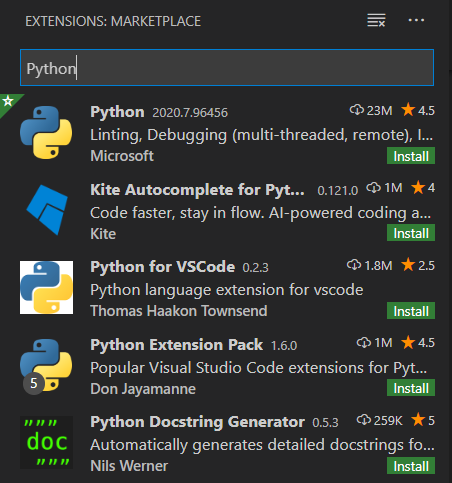


Now, click on the Python Extension by Microsoft (It should be the first one)

Click on install and wait for the installation to finish.

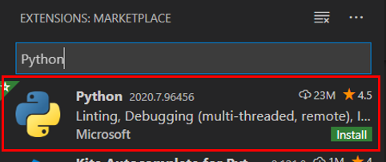

Once the installation is finished, you should see a Python Version on the Status Bar:


Now we have the capability to edit Python Code on VSCode properly!

Some of the features the Python Extension provides are:
- Code Completion
- Code formatting
- Code Linting
- Tests
- Refactoring & More!
----
### *Step 3: Making our workflow better:*

Now that we have installed the Python extension, we can run move onto the next part: 
**Installing and using a Language Server**

----

**What is a Python Language Server?**

A language server, to put it simply is a piece of software that makes our code writing experience better.

It contains some custom features like code analysis, finding references and infering types.

A Python Language Server is a language server is specific to Python and contains Python specific features.

back to the installation...

----

The most up-to-date Python Language Server as of the making of this guide is  ```Pylance```

To install Pylance, simply search for Pylance in the VSCode MarketPlace (***Extensions*** Panel)

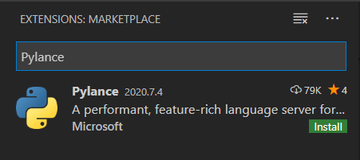

The publisher should be **Microsoft**.


Once it is installed, a window should popup asking you to make Pylance the default Language Server.

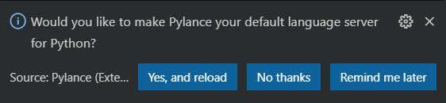

Click on **Yes, and Reload**. 

Once the window has reloaded, Pylance should automatically start analyzing your open Python Files.

Common Error: If you do not see the popup, you can follow the following steps:

- Open Settings(JSON) from the Command Palette
- Add the following line to your settings.json file:
    
```"python.languageServer":"Pylance"```
- If you see an error message saying "Value is not accepted", don't worry! Pylance is not officially in the settings documentation due to which it is shown as an error. **It will work nonetheless**

----

### *Step 4: Installing linters and formatters:*

A python linter is a package which checks our code for errors and helps us to make better code

A python formatter is a package which formats our code according to a particular convention (Usually PEP)

The linter that I personally use is : ```Pylint```.

The formatter that I use is: ```Black```.

To use Pylint as the default linter and black as the default formatter, we have to change a few settings.

Steps to enable Pylint:
- Open the Command Palette (Ctrl+Shift+P)
- Search for Python Linter
- Choose the option that says "Python: Select Linter"

- Choose pylint as your linter.
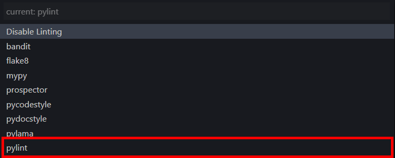

- You will get a popup asking you to install pylint if you haven't already.
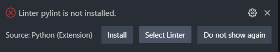

Steps to enable black:
- Open Settings(UI) from the Command Palette.
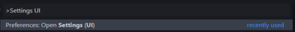

- Search for Python Formatting Provider 
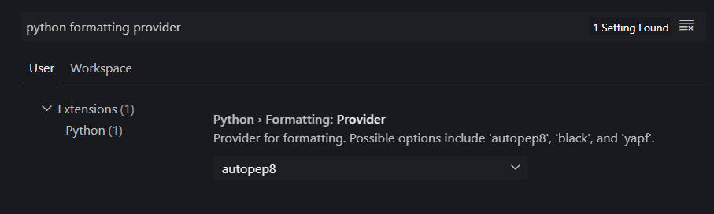

- Change the provider from autopep8 to **black**.

- You will get a popup asking you to install black if it isn't already.
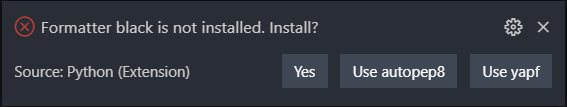

Now we have to ensure that we format and lint our file everytime we save our file.

To do so, add the following lines to your setting.json file:

```"python.linting.lintOnSave": true,```

```"editor.formatOnSave": true```

### *Step 5: Making VSCode less cluttered.*

If you look at your VSCode Setup right now, you might be feeling that is a bit cluttered and not a very pleasant editor to look at.

I'll be showing you how to fix that.

----
First part : Installing a custom font.

The font that I recommend to others the most is JetBrains Mono. (Although you can use other fonts with font ligatures).

Download JetBrains Mono from this link: https://download.jetbrains.com/fonts/JetBrainsMono-2.001.zip

Extract the file to your desired location. Once extracted, open the folder and go the ***/ttf*** section.
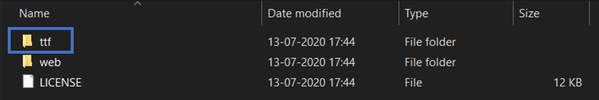

Click on JetBrains Mono Regular and install it.

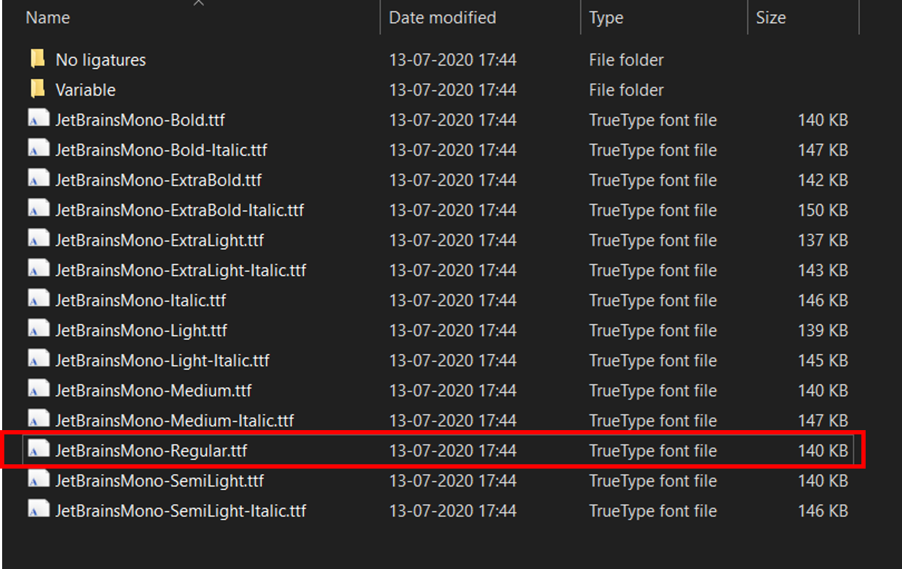

Once that is done, we need to enable it in VSCode. To do so,

add the following lines to your settings JSON file:

```"editor.fontFamily":"JetBrains Mono",```

```"editor.fontLigatures":true```

(Font ligatures are a way of combining specific characters to make our code easier to read. To learn more about it, visit this [Link](https://www.hanselman.com/blog/MonospacedProgrammingFontsWithLigatures.aspx))